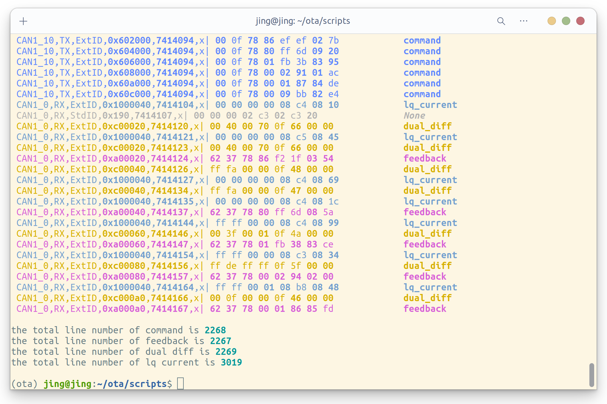

# Motivation

在着手分析 CAN 总线数据前，首先需要对其解码。一开始是感觉函数传参过多所以想要封装类似于 C 语言中结构体式的对象，后来则抽象出 `FilenameInfo`、`CanDataLine`、`CanData` 这三种类。如此一方面，理清数据结构后函数传参会更为简洁，而 `CanDataLine` 下继承的三个子类 `CanDataCmdFbLine`、`CanDataDualDiffLine`、`CanDataErrorLine` 会让代码更为明了而非写为分立的三个函数；另一方面，因为每个类在 `tests` 文件夹下都配备了对应的测试用例，这可以减轻合作程序员的理解和测试负担。更通俗地说，我们不能要求后续开发者去一头雾水地翻看我们写的函数，从主程序的入口开始往前调试函数的感觉就和你从最后一页开始阅读教科书一样糟糕，这也是为什么我认为应该用类这样一个类似于结构体的数据结构来贯穿项目，函数传参也应尽可能简洁地传一个类，如此一来对方只需看文档中对类和函数的描述即可，而不需要在意前人的实现细节。

如果更为粗糙地思考类的封装的话，这件事实际上在说：我们是如何从控制器报文解析这一过程中抽象出合适的对象以支持简洁的代码重用的。进一步地，稍微翻一下我的代码便会发现其中的层次结构：每一行报文分为控制反馈、编码器差值、错误行三种类型，而除去尾部的 Channel 数据，报文头部的 `time_stamp`、`joint_index` 属性却是类似的，所以我从 `CanDataLine` 父类中继承了三个子类 `CanDataCmdFbLine`、`CanDataDualDiffLine`、`CanDataErrorLine`；同时，总报文数据 `CanData` 本身便是由 `CanDataLine` 组成的，所以初始化 `CanData` 只需读取报文数据的每一行并将其属性 append 到 `CanData` 的属性即可。

# FilenameInfo

FilenameInfo 中包含 OTA 待分析文件名中包含的机器人和控制柜信息。对于文件名 `'HF-Zu7250213-20250723-2_Zu7250213_0_JK_PROD_Zu3 J1 10 倍频分析.jks_e2b8e40345a53855e739
eb1c1d5b1cf1.tar.gz'`，有如下结果。类代码中基本都是字符串的 split 操作，因为这相比正则表达式匹配更为直观简洁，毕竟 `pattern = r'^(?P<task_id>[^_]+)_(?P<robot_serial_number>[^_]+)_(?P<cabinet_serial_number>[^_]+)_(?P<joint>.+?)_(?P<md5>[a-f0-9]+)\.tar\.gz$'` 这种繁琐的表达式代码可读性是比较差的。

!!! note "Attributes of FilenameInfo"
    1. task_id             -  str    -  任务ID                        -  `'HF-Zu7250213-20250723-2'`
    2. robot_serial_num    -  str    -  机器人序列号                    -  `'Zu7250213'`
    3. robot_id            -  int    -  表示机器人机型                  -  `725`
    4. cabinet_serial_num  -  str    -  控制柜序列号                    -  `'0'`
    5. joint_index         -  int    -  表示后续需要分析当前数据的第几关节  -   `1`
    6. joint_speed_ratio   -  float  -  表示关节速度倍率                 -  `0.1`
    7. md5                 -  str    -  表示MD5码                      -  `'82fc5d1689a4bbde7a7bc9f4df619a1a'`

# CanDataLine

CanDataLine 代表 CAN 总线的某一行数据，如 `'CAN1_12,TX,ExtID,0x602000,990880491,x| 00 0f 78 80 db 34 82 76'` 中包含的关节状态信息。至于类方法的具体实现，即关节位置、扭矩和双编码器差值数据为什么这么解析则需要问一问写控制器的同事了。

!!! note "Attributes of CanDataLine"
    1. jks_line     -  str  -  JKS程序当前运行的行号               -  `'12'`
    2. time_stamp   -  int  -  报文时间戳                         -  `990880491`
    3. line_id      -  str  -  该行can数据的ID值                  -  `'0x602000'`
    4. line_data    -  str  -  can总线记录的该行各个通道的数据       -  `'x| 00 0f 78 80 db 34 82 76'`
    5. joint_index  -  int  -  表示该行数据记录的是哪个关节的状态信息  -  `0`

# CanData

`CanData` 负责解码机器人 CAN 总线 .tar.gz 数据文件中的 CAN 总线日志文件，分类提取命令、反馈、错误和双编码器数据，其属性的数据格式均为 `List[List[Any]]`，即 `[[Any] for i in range(0, 6)]`。类中有 `read_can_data_from_filepath` 方法是因为 CanData 需要从报文文件中读取每一行的 CanDataLine 数据，有 `align_attributes_to_shortest` 方法则是因为控制器极小概率会出现一行反馈指令接收紊乱的情况。

!!! note "Attributes of CanData"
    1. t_cmd / t_fb            -  指令 / 反馈行的相对时间戳    
    `[[0, 80, 162, 241, 321, ..., 187845, 187925, 188003, 188083], [...], [...], [...], [...], [...]]`
    2. q_cmd / q_fb            -  指令 / 反馈关节角          
    `[[1.572558007855984, ..., 1.572558007855984], [...], [...], [...], [...], [...]]`
    3. torque_cmd / torque_fb  -  指令 / 反馈扭矩            
    `[[-0.0001220703125, -0.0001220703125, ..., -0.0, -0.0], [...], [...], [...], [...], [...]]`
    4. dual_diff               -  双编码器差值角度            
    `[[0.0146484375, 0.0146484375, ..., 0.048828125, 0.048828125], [...], [...], [...], [...], [...]]`
    5. jks_line                -  JKS程序正在运行的行号       
    `[['0', '0', '0', ..., '0', '0'], [...], [...], [...], [...], [...]]`

在 `scripts` 文件夹下执行 `python check_can_lines.py` 命令即可得到如下输出，从中可以看出 CAN 总线报文数据的一般规律：先是六个关节角的下发控制指令，再是交替的 `dual_diff` 和 `feedback` 反馈数据。然而神奇的是，26个 OTA 报文文件中只有这个报文文件的该轮反馈出现了 `dual_diff` 多发一行而 `feedback` 少发一行的情况。其中终端中 `None` 行对应该报文 ID 不在识别序列中的情况，如有必要则需更新 `config/Config.py` 文件中的 `JOINT_CAN_LINE_IDS` 参数。

## Reference

[1] [Google 开源项目 Python 风格规范。就个人而言，我认为从 import package 开始，每一行代码都需要非常严格地遵守此规范，比如先 import 标准库，再 import 第三方库，最后 import 自己的 module，又比如 Class 的命名应采取驼峰命名法：这些显然都是代码可读的前提。](https://zh-google-styleguide.readthedocs.io/en/latest/google-python-styleguide/python_style_rules.html)