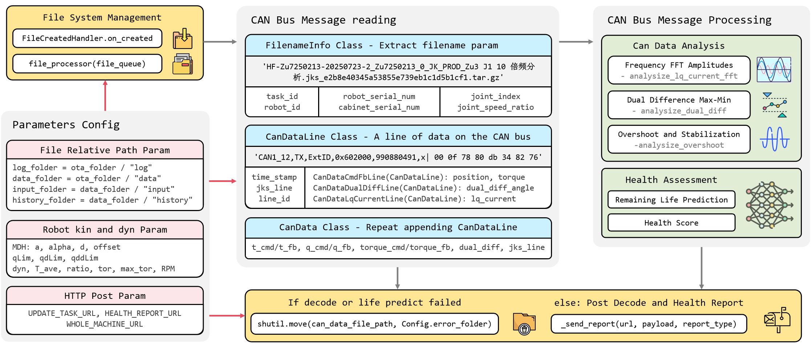

# Decode Workflow

OTA 需要解析 CAN 总线报文中所含机器人的各项数据，并预测出机器人的剩余寿命，总流程如下图所示。如此粗粗一瞥，项目代码的输入和输出似是明了：输入自然就是 `CAN_PATH` 下传入的 CAN 总线数据，输出即为 POST 到远端服务器的消息文本。然而，细细读过前人的代码便会发现，其中数据流交互盘根错节，面向过程编程导致项目结构臃肿、代码堆砌，更有甚者一个函数传入六个参数——如果在此基础上继续实现更多功能的话，只是在一堆糟糕的代码上写了一段同样糟糕的代码，因为当雪崩来临时，没有一朵雪花会是无辜的。

最让人痛心疾首的是 Whole Picture 的缺失：需要铭记于心的一点在于，项目代码是给别人看的，如果连作者都要在散落一地而无注释的函数中苦苦寻觅蛛丝马迹才能理解这个函数，又谈何在此基础上作二次开发呢？又谈何根据日志 log 文件快速地 debug 呢？从此 Python 沦为所谓的工具而再无简洁和可读性可言，这也是我绘制这幅图的初衷：面向对象和模块化编程。



1. 文件传入监测。从报文数据传入的角度来看，首先自然需要构建一个文件监视器，如引入 `watchdog.observers` 中的 `Observer()` 对象用于判断是否有文件移入 `data_folder` 文件夹，如有则触发文件处理函数 `process_file(can_data_file_path)`。如果熟悉 ROS 的话，会发现这类似于订阅者节点 `while (ros::ok()) {ros::spin(); }` 的监听操作。

2. 文件名参数提取及 CAN 总线数据解码。在着手 CAN 数据倍频、超调分析及剩余寿命预测之前，我们需要从采集的报文，如 `'CAN1_12,TX,ExtID,0x602000,990880491,x| 00 0f 78 80 db 34 82 76'` 中解析出控制器和机器人状态信息，比如其属于命令、反馈和错误类型的哪一种、JKS 程序的运行行号，以及关节角和双编码器数据。这个过程有些类似于在和外国朋友交谈时，脑子里需要将听到的英文先翻译成中文。

3. 根据 `FilenameInfo` 和 `CanData` 计算用户需要的末端位姿 `XYZ + RPY`，反馈关节角倍频、双编码器差值、超调量和稳定时间解析，以及健康指数和剩余寿命预测。其中前两者被封装在 `can_analysis_functions.py` 文件中，而后者还未实现。

4. 解析输出。末端位姿被写入到 csv 文件中，反馈关节角倍频幅值、双编码器差值级差等数据则以 `JSON` 键值对的形式被发送到服务器。如果沿用之前比喻的话，也就是说在 3 中思考完外国朋友的语义后，将自己的意思以英文口语形式反馈给对方。


# Code Structure

之所以要强调代码架构，是因为当你发现一棵树结出的果实不再可口时，这可能不是某个枝条的错误，而是因为这棵树的根已经溃烂了。虽然 OTA 的思路并不复杂，但是作为一个项目，如果主程序 `main.py` 几百行代码中各个数据解析函数、工具类、配置参数全堆在一起，如果代码结构没有 `module` 分层、没有明确的职责划分、也没有 `pytest` 测试或文档支持，一个功能从头写到尾的话，一旦需要开始做点“系统化”的事情，代码的可读性、可维护性、可扩展性都会迅速崩塌。

这里采用的是“眉清目秀”的 `src` 结构[<sup>1,</sup>](#refer-anchor-1)[<sup>2</sup>](#refer-anchor-2)，其中 `data` 为统一的输入输出目录，用于存放样例数据和运行结果， `src` 目录包含核心的业务逻辑代码，`tests` 文件夹中给出了对应功能的测试用例， `scripts` 文件夹则用于存放脚本执行入口、实验调试工具等。不过对于 `ota/src/decode` 下 `visualization.py` 等函数的位置是否妥当，`ota/config/Config.py` 配置文件是否应改为 `YAML` 等外部配置文件的格式以适应不同于 python 的系统诸如此类的事情还需斟酌。如果后续还有同事需要在此基础上作二次开发，比如剩余寿命预测的话，从面向对象编程的角度，可以按照其需求在类中添加新方法或者封装新的类；从代码架构的角度，则可以在 `src` 文件夹下写新的 `package`。

```
ota
├── config
│   ├── Config.py
│   └── robot.json
├── data
│   ├── input
│   │   ├── HF-Zu7250213-20250723-2_Zu7250213_0_JK_PROD_Zu3 J1 10 倍频分析.jks_e2b8e40345a53855e739eb1c1d5b1cf1.tar.gz
│   │   ├── HF-Zu7250213-20250723-2_Zu7250213_0_JK_PROD_Zu3 J1 双编码器差值.jks_ffeb8c0d0841a7c4b8ce39b5f94888bd.tar.gz
│   │   └── HF-Zu7250213-20250723-2_Zu7250213_0_JK_PROD_Zu3 J3 超调与稳定时间.jks_a5bcbf20c1fbe41ea16ab9ec8bb951d4.tar.gz
│   ├── output
│   ├── history
│   └── error
├── log
│   └── decode 2025-08-04.txt
├── src
│   ├── main.py
│   └── decode
│       ├── __init__.py
│       ├── can_analysis_functions.py
│       ├── CanDataLine.py
│       ├── CanData.py
│       ├── FilenameInfo.py
│       ├── report_sender.py
│       └── visualization.py
├── tests
│   ├── tests_data
│   └── decode
│       ├── test_CanDataLine.py
│       ├── test_CanData.py
│       └── test_FilenameInfo.py
├── document
│   ├── docs
│   ├── mkdocs.yml
│   └── site
├── scripts
│   └── bug_can_lines_read.py
├── requirements.txt
└── README.md
```

上述架构看似将问题复杂化了，实则不然。如果去 Github 上看一看 Python 第三方库，如 Flask 或者大型的深度学习开源项目，如 MMDetection 的项目目录，就会发现在开发中不得不对代码框架有所考虑。这样的好处在于，我如果想知道 CAN 总线报文关节角反馈行的样子，不必像从前一样在一堆函数中寻找关节角反馈行的报文解析函数，然后再在某个犄角旮旯处手动 print，而是可以在 `src/decode/CanDataLine.py` 这个类下迅速找到反馈行中各个参数的含义，并且在对应的测试用例 `tests/decode/test_CanDataLine.py` 中明了地看到其输入输出，同时可以在 `scripts` 文件夹下找到项目调试工具 `bug_can_lines_read.py` 以在终端中可视化报文。

## Reference

<div id="refer-anchor-1"></div>
[1] [知乎：Python 项目的结构设计与目录规范 —— 从脚本到模块，从混乱到整洁](https://zhuanlan.zhihu.com/p/1919163114521363941)

<div id="refer-anchor-2"></div>
[2] [Python 项目工程化开发指南 —— 项目结构](https://pyloong.github.io/pythonic-project-guidelines/guidelines/project_management/project_structure/)


