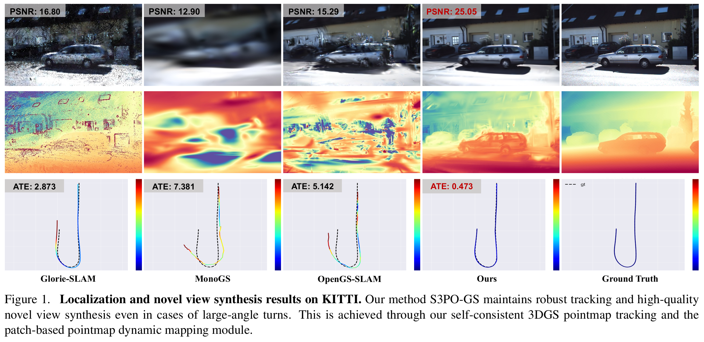

# S3PO-GS SLAM

{ width=100% style="display: block; margin: 0 auto;" }

一方面，之前一些支持 RGB 的 3DGS SLAM 通过光度误差的反向传播优化相机位姿，但是这种方法缺乏几何先验，且在室外环境中相机位姿的优化容易陷入局部最小值（lacks geometric priors）；另一方面，为了加强几何约束，Photo-SLAM 和 MGS-SLAM 分别引入独立的 ORB-SLAM3 跟踪模块和预训练模型来补充几何信息，增强姿态估计的鲁棒性，但是这种策略需要保持外部模块和 3DGS 地图之间的比例对齐 —— 在旋转和位移较大的场景下，累积误差容易导致 SLAM 系统的尺度漂移，降低后续的姿态估计和地图重建质量（scale drift）。

