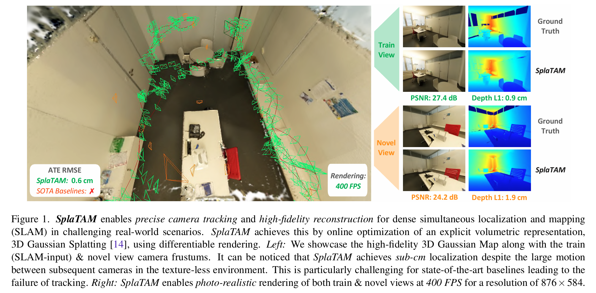

# SplaTAM

基于辐射场的SLAM算法受益于高保真全局地图和图像重建损失, 通过可微分渲染捕获密集的光度信息. 但是隐式神经表示面临计算效率低、不能轻易增加其容量或编辑其场景表示、灾难性遗忘的问题. 相比之下, 3D高斯泼溅有如下优势

地图具有明确空间范围, 并可轻松控制现有地图的空间边界. 而这对于隐式地图而言是困难的, 因为在针对为建图空间进行基于梯度的优化过程中, 网络的变化是全局的. 同时, 地图构建是显式的, 我们可以通过简单地添加更多的高斯椭球来增加地图容量, 这种显式的体积表示允许我们编辑部分场景时保持照片级的真实感渲染.

到参数的直接梯度流: 由于场景由具有物理3D位置、颜色和大小的高斯表示, 因此参数和渲染之间存在直接的、几乎线型的梯度流. 而隐式神经表示的优化则需要流经多层非线性网络层.

{ width=100% style="display: block; margin: 0 auto;" }


## 代码运行：Ubuntu20.04

```
conda create -n splatam python=3.10
conda activate splatam
conda install -c "nvidia/label/cuda-11.6.0" cuda-toolkit
conda install pytorch==1.12.1 torchvision==0.13.1 torchaudio==0.12.1 cudatoolkit=11.6 -c pytorch -c conda-forge
pip install -r requirements.txt
```
