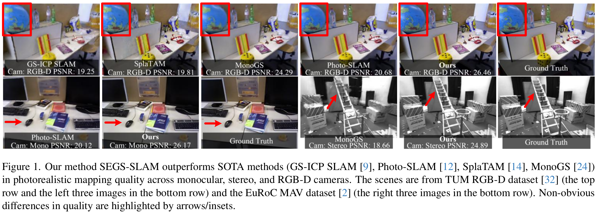
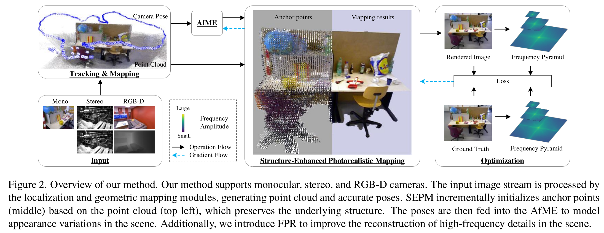

# SEGS-SLAM: SOTA

大多数基于 3D-GS 的 SLAM 算法忽略了场景中潜在的结构信息，从而限制了其渲染质量。尽管已有部分方法尝试改进精度、效率与语义信息，但对结构的利用仍然不足。例如，如图 1 第二行所示，MonoGS 在重建梯子结构时呈现出明显混乱的结构，这正是缺乏结构建模的结果。相较之下，少数方法如 Photo-SLAM 利用了场景结构。Photo-SLAM 使用间接视觉 SLAM 获得的点云初始化 3D 高斯，并引入了几何密化模块。在原始 3D-GS 中，3D 高斯是从 COLMAP 点中初始化的，而间接视觉 SLAM 与 COLMAP 拥有相似的流程，因此两者生成的点云具有相近的内在属性。因此，Photo-SLAM 的 3D 高斯能以较少迭代次数收敛到相对较优的结果，但它依然没有充分利用场景结构。如图 1 第二行所示，Photo-SLAM 对鼠标边缘的重建仍显模糊。

{ width=100% style="display: block; margin: 0 auto;" }

{ width=100% style="display: block; margin: 0 auto;" }

